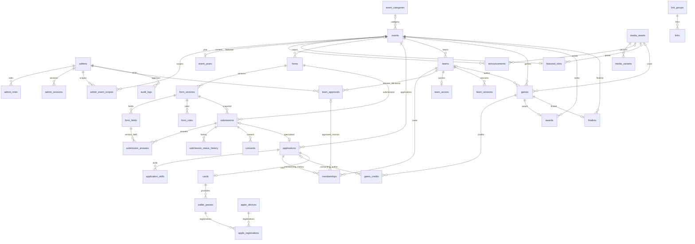

# Veritabanı omurgası — Görev 2

2 Ekim 2026. PostgreSQL 17 / Drizzle. Bu belge uygulanmış temel şemayı anlatır; sonraki ürün servislerinin tamamlandığını söylemez. Migration seed içermez: yönetici, kişi, takım, başvuru, kart, geçmiş oyun dahil 40 public tablo boş açılır. 2026 editoryal başlangıç yükü Görev 8'de ayrı komuttur.

Outbox, idempotency_records ve rate_limits polimorfik altyapı kayıtlarıdır; outbox aggregate ve audit object kimlikleri UUID'dir, birçok modüle ait olabildiği için tek tablo FK'si yoktur. Audit actor FK'si vardır. Başlangıç outbox API'si yalnızca UUID referansları taşır; kişi verisi ve sağlayıcı sırrını payload'a kabul etmez.

| Alan | FK / unique / CHECK kararı | İndeks ve zaman |
|---|---|---|
| Admin | Normalize e-posta ve token hash unique; admin-role ve admin-event bileşik PK; role allowlist | Admin/session expiry ve etkinlik scope reverse index; expiry > created |
| Etkinlik/içerik | Slug unique; kategoriler ve medya FK; statü/tür allowlist; kapasite/team size/revision pozitif; tarih aralığı tutarlı | Status+publish/start, announcement event; bilinmeyen tarihler NULL |
| Form/sürüm | Form+version unique; submission form/version bileşik FK; varsa form/event bileşik FK; field key sürüme bağlı; answer submission/version ve field/version bileşik FK; file türü kapalı | Form event, submission form+created+id cursor ve event+email, status history |
| UluJam | Event+normalize email unique; telefon NOT NULL ve E.164 biçimi; dört mod; skill 1–5; takım event+normalize name unique; memberships team/event ve application/event FK | Application cursor/status; takım review; tek aktif üyelik partial unique (left_at NULL); kapatılmış geçmiş üyelikler saklanır |
| Onay/erişim | Approval team+revision PK ve admin FK; membership approved revision aynı takım approval FK; yeni üyelikte NULL; erişim token hash unique | Team/session expiry index; roster/access revision pozitif; late member otomatik onay almaz |
| Oyun/derece | İsteğe bağlı takım aynı etkinlikte; awards/finalists game/event bileşik FK; sıra 1–3 ve event+rank unique; HTTPS itch.io hostname; bilinmeyen title/team/credits NULL | Game event; credit game; 2026 kısmi yayın ve rıza kontrolü Görev 8/20 servislerinde |
| Kart/Wallet | Application başına tek kart; pending default; provider/card ve provider/object unique; provider/status allowlist; yalnızca hashlenmiş erişim anahtarları | Apple registration reverse pass index; gerçek uygunluk Görev 18/22 |
| Link | Grup FK; pozisyon >=0; HTTPS veya yerel path; protokole göre URL kontrolü tabanda | Group+published+position; görünürlük penceresi |
| İşletme | Outbox type+aggregate+revision unique; attempts >=0; statü allowlist; idempotency scope+keyHash PK; rate window bileşik PK | Pending available ve processing lease partial index; expiry indeksleri |

Bütün anlar `timestamptz` olarak saklanır, uygulama İstanbul saatinde gösterir. Tablolar UUID `gen_random_uuid()` kullanır. Cascade silme yoktur; FK'ler NO ACTION'dır. Saklama/anonimleştirme politikası Görev 25'te kontrollü komutlarla uygulanır; personel veya içerik silinince ilişkili kayıtların sessizce kaybolması önlenir.

`getDatabase()` bağlantıyı ilk kullanımda açar; process başına en fazla 5 bağlantı, 20 sn idle ve 5 sn connect timeout vardır. Web/worker havuzları toplamı VDS'ye göre sonradan ölçülür. Server-only sınırı korunur. `withTransaction` transaction sonucunu döndürür ve hatayı korur; otomatik yan etkili retry yapmaz. Application değişikliği, `appendAudit` ve `enqueue` aynı `DbTx` ile yürür. Audit metadata strict allowlist'tir: yalnızca revision, önceki revision, izinli status ve değişen alan adları. Ham kişi değerleri, not/parola/token alınmaz.

## Migration ve test işletimi

- `pnpm db:generate`: Drizzle schema'dan yeni SQL/snapshot üretir; çıktı incelenmeden uygulanmaz.
- `pnpm db:check`: migration metadata tutarlılığını kontrol eder; PostgreSQL kabulünün yerine geçmez.
- `pnpm db:migrate`: pending migration'ları uygular, seed veya truncate yapmaz. İkinci çalışma yeni kayıt yaratmaz. Dağıtımda migration komutu tek işletme sürecinden çalıştırılır.
- `0000` temel şema; `0001` izolasyon kısıtlarıdır. Drizzle ikinci SQL'de yeni parent unique'i child FK'den sonra üretti: `form_event_identity_unique` elle FK'nin önüne taşındı. Snapshot aynı şemayı temsil eder; bu sıralama değişikliği gerçek boş DB testiyle doğrulandı.
- Testler her koşuda yalnızca localhost PostgreSQL'de rastgele `uludott_test_*` veritabanı açar ve kaldırır; geliştirme DB'sini truncate etmez. Yerel test DB oluşturma izni gerekir. Test örnekleri buradadır, üretim migration'ında yoktur.
- Next standalone web imajı migration CLI ortamı değildir; migration kaynak/dependency ortamından dağıtım öncesi çalıştırılır. Canlı paketleme Görev 28'de tamamlanır.

Takım kapasite kilidi/constraint trigger, tam NFKC Türkçe isim normalizasyonu, yayımlanmış form snapshot değişmezliği, başvuru kapasite yarışı ve Wallet uygunluğu ilgili sonraki görevlerde servis ve DB testleriyle tamamlanır. Buradaki iskelet bu domain kabulünü kendiliğinden sağlamaz. Hash/encrypted adları kriptografik uygulamanın tamamlandığını söylemez; gerçek üretim ve doğrulama Görev 3/12/17/24'te yapılır.

## Görev 6 şema genişletmesi

0003: etkinlikte excerpt/organizer/location_type/media_id/form_id, duyuruda excerpt/seo/cta_url/cta_label, `content_redirects` eski slug envanteri. Yeni toplam 41 public tablo. 0004: events(id,form_id) → forms(event_id,id) bileşik FK, location_type physical/online CHECK. Döngüsel referans migration ile iki tablo kurulduktan sonra eklenir; TypeScript callback dönüş tipi AnyPgColumn ile açıkça tanımlanır. Etkinlik afişinin FK'si media_assets'e bağlıdır. Soft arşivleme, redirect hedef kimliğini ve audit geçmişini korur. Yayın alanları mevcut publish_at/unpublish_at/revision omurgasını kullanır; worker olmadan okuma anındaki zaman penceresi görünürlüğü belirler.
