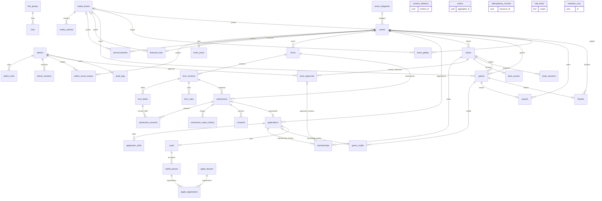

# Güncel ER ve tablo envanteri

3 Ekim 2026: gerçek boş migration/restore tatbikatında43 public tablo. Eski [database.md](database.md) görev2–12 tarihî değişimlerini içerir; güncel kaynak src/db/schema ve migration journal.

Tablolar: `admin_event_scopes`, `admin_roles`, `admin_sessions`, `admins`, `announcements`, `apple_devices`, `apple_registrations`, `application_skills`, `applications`, `audit_logs`, `awards`, `cards`, `consents`, `content_redirects`, `event_categories`, `event_gallery`, `event_years`, `events`, `featured_slots`, `finalists`, `form_fields`, `form_rules`, `form_versions`, `forms`, `game_credits`, `games`, `idempotency_records`, `link_groups`, `links`, `media_assets`, `media_variants`, `memberships`, `outbox`, `rate_limits`, `retention_runs`, `submission_answers`, `submission_status_history`, `submissions`, `team_access`, `team_approvals`, `team_sessions`, `teams`, `wallet_passes`.

Outbox/redirect/audit nesne kimliği polimorfik referanstır; tek hedefFK varsayılmaz. form/event, submission/version, answer/version-field ve team/event bileşikFK izolasyonu sağlar; active membership partial unique. Approval roster revision üzerinden bağlı; geç üye onaysızdır. Form yayın snapshotları trigger ile değişmez. AUTH ile şifreli capability replay ve MFA alanları PG yedek ve ayrı anahtar kasası ile kurtarılır; eposta/event tekil, telefon zorunlu. S3 media keys DB ile eşlenir; [restore](../operations/backup-restore.md).

Genel form yanıtları JSONB ve aranabilir kişi kolonları DB içinde açık değerdir; AUTH anahtarı bunları topluca şifrelemez. DB/disk erişimi, sunucu yetkisi ve şifreli dış yedek bu veriler için ayrıca korunur.
