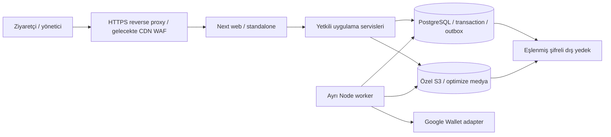

# Uludott mimarisi

3 Ekim 2026; uygulanmış yerel aday. Tasarımın tarihî bağlamı [mimari öneride](../design/2026-10-01-mimari-oneri.md), güncel kabul [son matriste](../operations/final-acceptance.md).

Sunum `src/app` ve module UI; kurallar module domain/application; SQL infrastructure ve `src/db/schema`; HTTP servisleri rol/etkinlik kapsamı, CSRF, hız, sürüm ve idempotency kontrolünü yapar. Server-only sınırı SQL/sır/sağlayıcı verisini tarayıcıdan ayırır. Genel ziyaretçi hesabı yok; admin MFA, takım oturumu ve kişi capability erişimi ayrıdır.

Her process DB havuzu en fazla5 bağlantı. Transaction başvuru/kontenjan, üyelik, audit ve outbox'ı birlikte yazar; dış sağlayıcı isteği mevcut Google akışında kartı kilitleyen transaction içinde yapılır: ilk Save isteği senkron eşitleme/link üretir, sonraki düzeltme/retry worker üzerinden yürür. Bounded provider timeout ve kart revision kilidi tutarlılığı korurken ağ gecikmesi DB kilidini ve web isteğini uzatabilir; kapasite ölçümünde bu maliyet hesaba katılır. Worker lease/backoff/dead-job ve revision kontrolleriyle tekrar güvenlidir; retry güncel uygunluğu yeniden değerlendirir. HTML nonce CSP için dinamik/no-store; statik JS/CSS cache ayrı. Özel kart/takım/makbuz no-store/noindex ve sınırlı alanlar sunar.

43 public tablo; [ER](er-diagram.md). Medya orijinalleri özel, yayınlanmış türev uygulama route'undan erişilir. Yerel Garage üretim sağlayıcısı değildir. Web ve worker [ayrı runtime hedefleriyle](../operations/deploy.md) aynı sürüm/DB/auth ayarlarını kullanır. Apple adapter/cihaz kabulü ücretli hesap nedeniyle ertelendi; Google demo ve public ayrı durumlar. E-posta/alarm/CDN adaptörlerinin gerçek tenant kabulü açık; [kararlar](decision-log.md).
